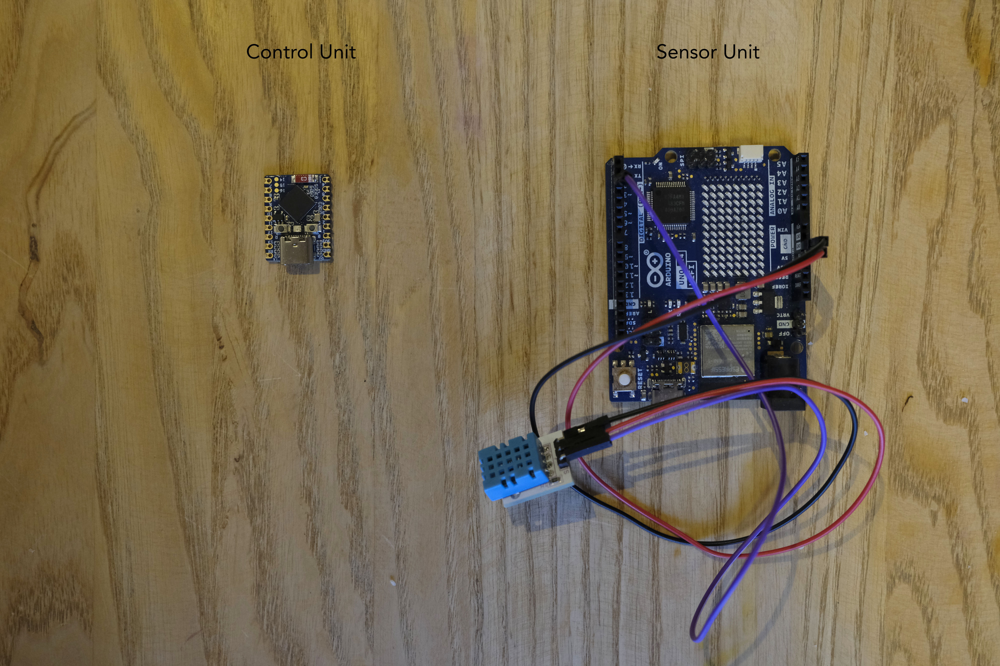

# Chas Advance - Group 4 - Embedded

Chas Advance is developed by students as part of the education at Chas Academy.  
It is a full featured logistics system designed to track packages from sender to receiver  

Features:  

- web/mobile apps for customers, vehicle drivers, senders and admin  
- a backend rest server and database  
- a sensor suite that guarantees that packages stay within given limits  

This repo is for the embedded parts of the project. It consists of two separate codebases.  

## Cloning the repository

This project uses Git submodules. You have to initialize them when cloning.  

### Option 1 Clone and initialize  

```bash
git clone --recurse-submodules https://github.com/Chas-Advance-Grupp-4/embedded
```

### Option 2 If you already cloned without initialization

Navigate to the repo folder and run this in the terminal:  

```bash
git submodule update --init --recursive
```

---

### Code analysis with cpp check

To run code analysis/linting you need to install [cppcheck](http://cppcheck.net)  

## 1. Control Unit

`controlunit/` folder  

ESP32 based Gateway that handles connections both with the Backend Server and the Sensor Units.  

Board: Waveshare ESP32-S3-Zero  
Framework: ESP-IDF

Info and installation instructions: [/controlunit/README.md](/controlunit/README.md)  

## 2. Sensor Unit

`sensorunit/` folder  

Arduino based controller that collects sensor readings and forwards them to the Control Unit.  

Board: Arduino UNO R4 Wifi  
Framework: PlatformIO/Arduino  

Info and installation instructions: [/sensorunit/README.md](/sensorunit/README.md)  

---

  

---
For any additional information about the embedded repo contact [Erik Dahl](https://github.com/erikdsp)  
